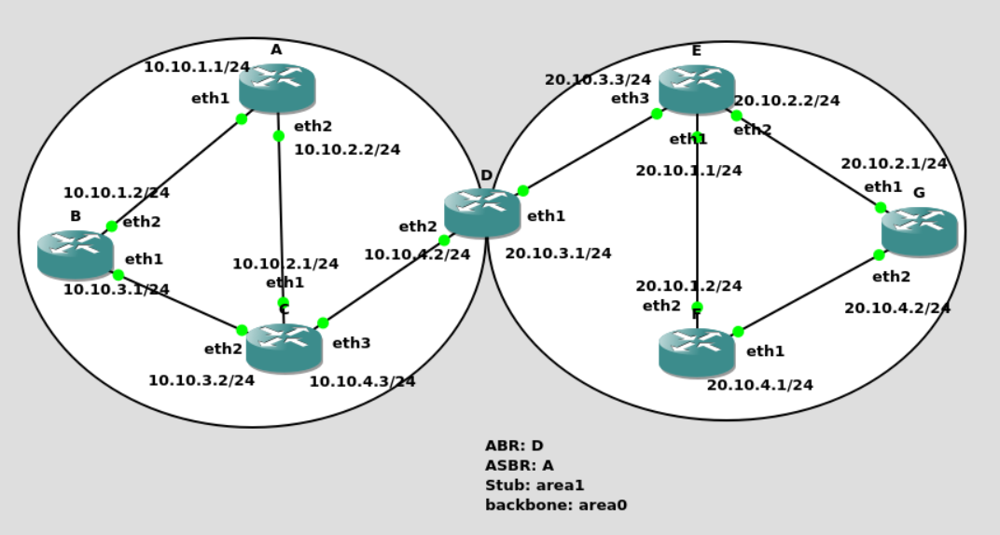

**this is a frrouting ospf configure tutorial!**

### 1. ospf topology
--------------------

all the interface will bind in openswitch, ovs-docker will manage them

### 2. envirment configure
--------------------------

os: ubuntu24.04
docker: quay.io/frrouting/frr:10.0.0
frr: release 10.0.0
ovs: apt install -y openswitch

### 3. test lab details description
-----------------------------------

1. lab1

    ospf basical configure, you could learn some basical command to configure ospf.

    ospf area:
        
        stub area
        backbone area
    link network:

        broadcast
2. lab2

    ospf area:
        
        stub area
        backbone area
    link network:

        broadcast

3. lab3

    test redistribute kernel route to ospf based lab1

3. lab4

    test p2p network with gre for ospf

4. lab5

    test p3mp network with mgre for ospf

5. lab6
   
   test ospf multip-instances to split different terminal router route table

6. lab7
 
   test ospf vrf to split different terminal router route table
