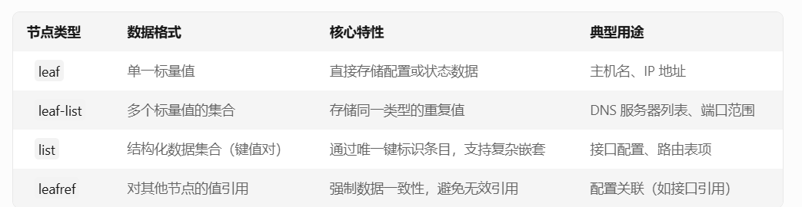

#### 1. yang node



#### 2. mgmt configure

[frr/tests/topotests/mgmt_tests/test_yang_mgmt.py at frr-10.0 · FRRouting/frr](https://github.com/FRRouting/frr/blob/frr-10.0/tests/topotests/mgmt_tests/test_yang_mgmt.py)

```bash

# 依赖xpath 1.0 版本

# 这里配置的格式是最终操作的某个叶子节点，所以xpath格式如下: "/*/*/*/leafname value"
# 查询的格式可以是到叶子节点或者其他类型节点，不需要带value, 所以xpath格式如下: "/*/*/leafname"

# 添加一条static的路由
mgmt set-config /frr-routing:routing/control-plane-protocols/control-plane-protocol[type='frr-staticd:staticd'][name='staticd'][vrf='default']/frr-staticd:staticd/route-list[prefix='192.1.1.2/32'][afi-safi='frr-routing:ipv4-unicast']/path-list[table-id='0'][distance='1']/frr-nexthops/nexthop[nh-type='blackhole'][vrf='default'][gateway=''][interface='(null)']/bh-type unspec

mgmt set-config /frr-routing:routing/control-plane-protocols/control-plane-protocol[type='frr-staticd:staticd'][name='staticd'][vrf='default']/frr-staticd:staticd/route-list[prefix='10.10.1.9/32'][afi-safi='frr-routing:ipv4-unicast']/path-list[table-id='0'][distance='1']/frr-nexthops/nexthop[nh-type='ip4'][vrf='default'][gateway=''][interface='eth1']/vrf default

# 检查配置
mgmt commit check

# 应用配置
mgmt commit apply
# 删除上一个错误配置
# mgmt commit abort

# 查看结果
show ip route

# 删除一条static路由
mgmt delete-config /frr-routing:routing/control-plane-protocols/control-plane-protocol[type='frr-staticd:staticd'][name='staticd'][vrf='default']/frr-staticd:staticd/route-list[prefix='192.1.1.2/32'][afi-safi='frr-routing:ipv4-unicast']

mgmt commit check
mgmt commit apply

# 查看结果
show ip route

# 查询mgmt配置
show mgmt get-config running /frr-routing:routing/control-plane-protocols/control-plane-protocol[type='frr-staticd:staticd'][name='staticd'][vrf='default']/frr-staticd:staticd/route-list[prefix='10.10.1.9/32'][afi-safi='frr-routing:ipv4-unicast']
[
  "/frr-routing:routing/control-plane-protocols/control-plane-protocol[type='frr-staticd:staticd'][name='staticd'][vrf='default']/frr-staticd:staticd/route-list[prefix='10.10.1.9/32'][afi-safi='frr-routing:ipv4-unicast']/prefix": "10.10.1.9/32"
  "/frr-routing:routing/control-plane-protocols/control-plane-protocol[type='frr-staticd:staticd'][name='staticd'][vrf='default']/frr-staticd:staticd/route-list[prefix='10.10.1.9/32'][afi-safi='frr-routing:ipv4-unicast']/afi-safi": "frr-routing:ipv4-unicast"
  "/frr-routing:routing/control-plane-protocols/control-plane-protocol[type='frr-staticd:staticd'][name='staticd'][vrf='default']/frr-staticd:staticd/route-list[prefix='10.10.1.9/32'][afi-safi='frr-routing:ipv4-unicast']/path-list[table-id='0'][distance='1']/table-id": "0"
  "/frr-routing:routing/control-plane-protocols/control-plane-protocol[type='frr-staticd:staticd'][name='staticd'][vrf='default']/frr-staticd:staticd/route-list[prefix='10.10.1.9/32'][afi-safi='frr-routing:ipv4-unicast']/path-list[table-id='0'][distance='1']/distance": "1"
  "/frr-routing:routing/control-plane-protocols/control-plane-protocol[type='frr-staticd:staticd'][name='staticd'][vrf='default']/frr-staticd:staticd/route-list[prefix='10.10.1.9/32'][afi-safi='frr-routing:ipv4-unicast']/path-list[table-id='0'][distance='1']/tag": "0"
  "/frr-routing:routing/control-plane-protocols/control-plane-protocol[type='frr-staticd:staticd'][name='staticd'][vrf='default']/frr-staticd:staticd/route-list[prefix='10.10.1.9/32'][afi-safi='frr-routing:ipv4-unicast']/path-list[table-id='0'][distance='1']/frr-nexthops/nexthop[nh-type='ip4'][vrf='default'][gateway=''][interface='eth1']/nh-type": "ip4"
  "/frr-routing:routing/control-plane-protocols/control-plane-protocol[type='frr-staticd:staticd'][name='staticd'][vrf='default']/frr-staticd:staticd/route-list[prefix='10.10.1.9/32'][afi-safi='frr-routing:ipv4-unicast']/path-list[table-id='0'][distance='1']/frr-nexthops/nexthop[nh-type='ip4'][vrf='default'][gateway=''][interface='eth1']/vrf": "default"
  "/frr-routing:routing/control-plane-protocols/control-plane-protocol[type='frr-staticd:staticd'][name='staticd'][vrf='default']/frr-staticd:staticd/route-list[prefix='10.10.1.9/32'][afi-safi='frr-routing:ipv4-unicast']/path-list[table-id='0'][distance='1']/frr-nexthops/nexthop[nh-type='ip4'][vrf='default'][gateway=''][interface='eth1']/gateway": ""
  "/frr-routing:routing/control-plane-protocols/control-plane-protocol[type='frr-staticd:staticd'][name='staticd'][vrf='default']/frr-staticd:staticd/route-list[prefix='10.10.1.9/32'][afi-safi='frr-routing:ipv4-unicast']/path-list[table-id='0'][distance='1']/frr-nexthops/nexthop[nh-type='ip4'][vrf='default'][gateway=''][interface='eth1']/interface": "eth1"
  "/frr-routing:routing/control-plane-protocols/control-plane-protocol[type='frr-staticd:staticd'][name='staticd'][vrf='default']/frr-staticd:staticd/route-list[prefix='10.10.1.9/32'][afi-safi='frr-routing:ipv4-unicast']/path-list[table-id='0'][distance='1']/frr-nexthops/nexthop[nh-type='ip4'][vrf='default'][gateway=''][interface='eth1']/bh-type": "null"
  "/frr-routing:routing/control-plane-protocols/control-plane-protocol[type='frr-staticd:staticd'][name='staticd'][vrf='default']/frr-staticd:staticd/route-list[prefix='10.10.1.9/32'][afi-safi='frr-routing:ipv4-unicast']/path-list[table-id='0'][distance='1']/frr-nexthops/nexthop[nh-type='ip4'][vrf='default'][gateway=''][interface='eth1']/onlink": "false"
]

```