#### 1. BGP4协议介绍

BGP（Border Gateway Protocol，边界网关协议）是一种用于AS（Autonomous System，自治系统）之间的动态路由协议。**AS是拥有同一选路策略，在同一技术管理部门下运行的一组路由器**。

早期发布的三个版本分别是BGP-1（RFC 1105）、BGP-2（RFC 1163）和BGP-3（RFC 1267），当前使用的版本是BGP-4（RFC 1771，已更新至RFC 4271）。BGP-4作为事实上的Internet外部路由协议标准，被广泛应用于ISP（Internet Service Provider，因特网服务提供商）之间。

Internet外部路由协议标准，被广泛应用于ISP（Internet Service Provider，因特网服务提供商）之间。

------

& 说明：

下文中若不做特殊说明，所指的BGP均为BGP-4。

------


##### 1.1 BGP特性描述

- BGP是一种外部网关协议（Exterior Gateway Protocol，EGP），与OSPF、RIP等内部网关协议（Interior Gateway Protocol，IGP）不同，其着眼点不在于发现和计算路由，而在于控制路由的传播和选择最佳路由。

- BGP使用TCP作为其传输层协议（端口号179），提高了协议的可靠性。

- BGP支持CIDR（Classless Inter-Domain Routing，无类别域间路由）。

- 路由更新时，BGP只发送更新的路由，大大减少了BGP传播路由所占用的带宽，适用于在Internet上传播大量的路由信息。

- BGP路由通过携带AS路径信息彻底解决路由环路问题。

- BGP提供了丰富的路由策略，能够对路由实现灵活的过滤和选择。

- BGP易于扩展，能够适应网络新的发展。

发送BGP消息的路由器称为BGP发言者（BGP Speaker），它接收或产生新的路由信息，并发布（Advertise）给其它BGP发言者。当BGP发言者收到来自其它自治系统的新路由时，如果该路由比当前已知路由更优、或者当前还没有该路由，它就把这条路由发布给自治系统内所有其它BGP发言者。

相互交换消息的BGP发言者之间互称对等体（Peer），若干相关的对等体可以构成对等体组（Peer group）。

BGP在路由器上以下列两种方式运行：

- IBGP（Internal BGP）：当BGP运行于同一自治系统内部时，被称为IBGP；

- EBGP（External BGP）：当BGP运行于不同自治系统之间时，称为EBGP。

#### 2. BGP的消息类型

##### 2.2 BGP消息类型

BGP报文有两部分组成，一部分是bgp消息头类型，一部分是具体bgp消息，两者组合成一个完整的bgp报文

 [完整BGP抓包](../../../pcap/frrouting/bgp/bgp4.pcap) 

##### 2.2.1 消息头类型

BGP有5种消息类型：Open、Update、Notification、Keepalive和Route-refresh。这些消息有相同的报文头，其格式如图1所示。

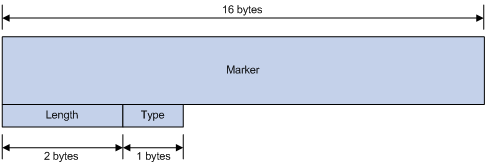

图1 BGP消息的报文头格式

主要字段的解释如下：

- **Marker**：16字节，用于标明BGP报文边界，所有比特均为“1”。

- **Length**：2字节，BGP消息总长度（包括报文头在内），以字节为单位。

- **Type**：1字节，BGP消息的类型。其取值从1到5，分别表示Open、Update、Notification、Keepalive和Route-refresh消息。其中，前四种消息是在RFC 1771中定义，而Type为5的消息则是在RFC 2918中定义的。

###### 2.2.2 Open

Open消息是TCP连接建立后发送的第一个消息，用于建立BGP对等体之间的连接关系。其消息格式如图2所示。

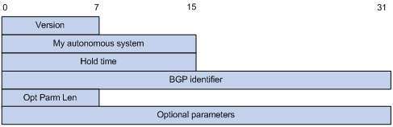

图2 BGP Open消息格式

主要字段的解释如下：

- **Version**：BGP的版本号。对于BGP-4来说，其值为4。

- **My autonomous system**：本地AS号。通过比较两端的AS号可以确定是EBGP连接还是IBGP连接。

- **Hold time**：保持时间。在建立对等体关系时两端要协商Hold Time，并保持一致。如果在这个时间内未收到对端发来的Keepalive消息或Update消息，则认为BGP连接中断。

- **BGP identifier**：BGP标识符。以IP地址的形式表示，用来识别BGP路由器。

- **Opt Parm Len（Optional Parameters Length）**：可选参数的长度。如果为0则没有可选参数。

- **Optional parameters**：可选参数。用于多协议扩展（Multiprotocol Extensions）等功能。

###### 2.2.3 Update

Update消息用于在对等体之间交换路由信息。它既可以发布可达路由信息，也可以撤销不可达路由信息。其消息格式如图3所示。

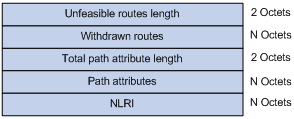

图3 BGP Update消息格式

一条Update报文可以通告一类具有相同路径属性的可达路由，这些路由放在NLRI（Network Layer Reachable Information，网络层可达信息）字段中，Path Attributes字段携带了这些路由的属性，BGP根据这些属性进行路由的选择；同时Update报文还可以携带多条不可达路由，被撤销的路由放在Withdrawn Routes字段中。

主要字段的解释如下：

- **Unfeasible routes length**：不可达路由字段的长度，以字节为单位。如果为0则说明没有Withdrawn Routes字段。

- **Withdrawn routes**：不可达路由的列表。

- **Total path attribute length**：路径属性字段的长度，以字节为单位。如果为0则说明没有Path Attributes字段。

- **Path atributes**：与NLRI相关的所有路径属性列表，每个路径属性由一个TLV（Type-Length-Value）三元组构成。BGP正是根据这些属性值来避免环路，进行选路，协议扩展等。

- **NLRI（Network Layer Reachability Information）**：可达路由的前缀和前缀长度二元组。1.2.4 Notification

###### 2.2.4 Notification

当BGP检测到错误状态时，就向对等体发出Notification消息，之后BGP连接会立即中断。其消息格式如图4所示。

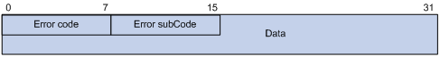

图4 BGP Notification消息格式

主要字段的解释如下：

- **Error code**：差错码，指定错误类型。

- **Error subcode**：差错子码，错误类型的详细信息。

- **Data**：用于辅助发现错误的原因，它的内容依赖于具体的差错码和差错子码，记录的是出错部分的数据，长度不固定

###### 2.2.5 Keepalive

BGP会周期性地向对等体发出Keepalive消息，用来保持连接的有效性。其消息格式中只包含报文头，没有附加其他任何字段。

###### 2.2.6 Route-refresh

Route-refresh消息用来要求对等体重新发送指定地址族的路由信息。其消息格式如图5所示。

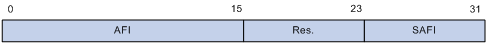

图5 BGP Route-refresh消息格式

主要的字段解释如下：

- **AFI**：Address Family Identifier，地址族标识。

- **Res**：保留，必须置0。

- **SAFI**：Subsequent Address Family Identifier，子地址族标识。

#### 3. BGP的路由属性

##### 3.1 路由属性的分类

BGP路由属性是一组参数，它对特定的路由进行了进一步的描述，使得BGP能够对路由进行过滤和选择。

事实上，所有的BGP路由属性都可以分为以下四类：

- 公认必须遵循（Well-known mandatory）：所有BGP路由器都必须能够识别这种属性，**且必须存在于Update消息中**。如果缺少这种属性，路由信息就会出错。

  > ORIGIN，AS_PATH，NEXT_HOP

- 公认可选（Well-known discretionary）：所有BGP路由器都可以识别，但不要求必须存在于Update消息中，可以根据具体情况来选择。

  > LOCAL_PREF，ATOMIC_AGGREGATE

- 可选过渡（Optional transitive）：在AS之间具有可传递性的属性。BGP路由器可以不支持此属性，但它仍然会接收带有此属性的路由，并通告给其他对等体。

  > AGGREGATOR，COMMUNITY

- 可选非过渡（Optional non-transitive）：如果BGP路由器不支持此属性，该属性被忽略，且不会通告给其他对等体。

  > MULTI_EXIT_DISC (MED)，ORIGINATOR_ID，CLUSTER_LIST

BGP路由几种基本属性和对应的类别如表1所示。

表1 路由属性和类别

| 属性名称              | 类别         |
| --------------------- | ------------ |
| ORIGIN                | 公认必须遵循 |
| AS_PATH               | 公认必须遵循 |
| NEXT_HOP              | 公认必须遵循 |
| LOCAL_PREF            | 公认可选     |
| ATOMIC_AGGREGATE      | 公认可选     |
| AGGREGATOR            | 可选过渡     |
| COMMUNITY             | 可选过渡     |
| MULTI_EXIT_DISC (MED) | 可选非过渡   |
| ORIGINATOR_ID         | 可选非过渡   |
| CLUSTER_LIST          | 可选非过渡   |

##### 3.2  路由属性详解

###### 3.2.1  源（ORIGIN）属性

ORIGIN属性定义路由信息的来源，标记一条路由是怎么成为BGP路由的。它有以下三种类型：

- IGP：优先级最高，说明路由产生于本AS内。

- EGP：优先级次之，说明路由通过EGP学到。

- incomplete：优先级最低，它并不是说明路由不可达，而是表示路由的来源无法确定。例如，引入的其它路由协议的路由信息。

###### 3.2.2 AS路径（AS_PATH）属性

**AS_PATH属性按一定次序记录了某条路由从本地到目的地址所要经过的所有AS号**。当BGP将一条路由通告到其他AS时，便会把本地AS号添加在AS_PATH列表的最前面。收到此路由的BGP路由器根据AS_PATH属性就可以知道去目的地址所要经过的AS。离本地AS最近的相邻AS号排在前面，其他AS号按顺序依次排列。如图6所示。**AS_PATH的AS路径是在EBGP之间才有用，AS_PATH可以用于EBGP防环**

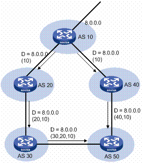

**通常情况下，EBGP不会接受AS_PATH中已包含本地AS号的路由，从而避免了形成路由环路的可能。**

同时，AS_PATH属性也可用于路由的选择和过滤。在其他因素相同的情况下，BGP会优先选择路径较短的路由。比如在图6中，AS 50中的BGP路由器会选择经过AS 40的路径作为到目的地址8.0.0.0的最优路由。

在某些应用中，可以使用路由策略来人为地增加AS路径的长度，以便更为灵活地控制BGP路径的选择。

通过AS路径过滤列表，还可以针对AS_PATH属性中所包含的AS号来对路由进行过滤。

###### 3.2.3 NEXT_HOP属性

BGP的下一跳属性和IGP的有所不同，不一定就是邻居路由器的IP地址。

下一跳属性取值情况分为三种，如所示。

- BGP发言者把自己产生的路由发给所有邻居时，将把该路由信息的下一跳属性设置为自己与对端连接的接口地址；

- BGP发言者把接收到的路由发送给EBGP对等体时，将把该路由信息的下一跳属性设置为本地与对端连接的接口地址；

- BGP发言者把从EBGP邻居得到的路由发给IBGP邻居时，并不改变该路由信息的下一跳属性。如果配置了负载分担，路由被发给IBGP邻居时则会修改下一跳属性。

  > **在将路由传递给自己的IBGP对等体时，也会保持路由的Next_hop属性值不变 ，这就会出现一种情况，就是IBGP对等体与下一跳属性的IP地址网络不可达**，为了避免出现这样的情况，可以通过next-hop-self变更next-hop属性。
  > next-hop-self告诉自己的ibgp，下一跳是自己。

  ```bash
  # 设置从EBGP接收的路由，宣告给对等体时候，将下一跳地址设置为自身,防止出现网络不可达.配置在EBGP上
  neighbor 20.10.1.6 next-hop-self
  ```

  

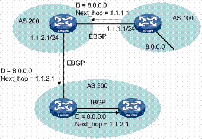

###### 3.2.4  MED（MULTI_EXIT_DISC）属性

MED属性仅在相邻两个AS之间交换，收到此属性的AS一方不会再将其通告给任何其他第三方AS。

**MED属性相当于IGP使用的度量值（metrics），它用于判断流量进入AS时的最佳路由，属性在RouterB和C上配置，发布给RouterA**。当一个运行BGP的路由器通过不同的EBGP对等体得到目的地址相同但下一跳不同的多条路由时，在其它条件相同的情况下，将优先选择MED值较小者作为最佳路由。如图8所示，从AS 10到AS 20的流量将选择Router B作为入口。

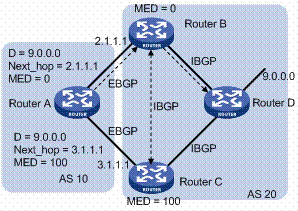

通常情况下，BGP只比较来自同一个AS的路由的MED属性值。

> RouterA上会有两个到9.0.0.0的路由，只不过路由的metric不同

###### 3.2.5 本地优先（LOCAL_PREF）属性

**LOCAL_PREF属性仅在IBGP对等体之间交换，不通告给其他AS。它表明BGP路由器的优先级**。

LOCAL_PREF属性用于判断流量离开AS时的最佳路由。当BGP的路由器通过不同的IBGP对等体得到目的地址相同但下一跳不同的多条路由时，将优先选择LOCAL_PREF属性值较高的路由。如图9所示，从AS 20到AS 10的流量将选择Router C作为出口。

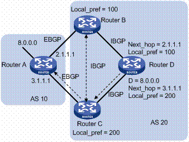

###### 3.2.6  团体（COMMUNITY）属性

团体属性用来简化路由策略的应用和降低维护管理的难度。它是一组有相同特征的目的地址的集合，没有物理上的边界，与其所在的AS无关。公认的团体属性有：

- INTERNET：缺省情况下，所有的路由都属于INTERNET团体。具有此属性的路由可以被通告给所有的BGP对等体。

- NO_EXPORT：具有此属性的路由在收到后，不能被发布到本地AS之外。如果使用了联盟，则不能被发布到联盟之外，但可以发布给联盟中的其他子AS。

- NO_ADVERTISE：具有此属性的路由被接收后，不能被通告给任何其他的BGP对等体。

- NO_EXPORT_SUBCONFED：具有此属性的路由被接收后，不能被发布到本地AS之外，也不能发布到联盟中的其他子AS。

###### 3.2.7

###### 3.2.8

###### 3.2.9

#### 4. BGP解决IBGP全互联[Full Mesh]的方法

在标准 IBGP 中，为了防止路由信息在 AS 内部形成环路，规定 **IBGP Speaker 不能将从 IBGP 对等体学到的路由再通告给其他 IBGP 对等体**（即“不转发 IBGP 路由”）。这导致在一个拥有 N 台路由器的 AS 内，必须建立 N(N−1)/2个 IBGP 连接（全互联），当 N 很大时（如 100 台需要 4950 个连接），配置和维护成本极高。

**联盟和 RR 的作用就是打破这个物理限制，让路由能在 AS 内部“接力”传播，而无需每两台设备都直连。**

两者虽然目标一致（解决规模问题），但实现原理和适用场景有本质区别：

| 特性           | **路由反射器 (Route Reflector)**                             | **联盟 (Confederation)**                                     |
| -------------- | ------------------------------------------------------------ | ------------------------------------------------------------ |
| **核心原理**   | 指定一台或多台路由器为“反射器”（RR），**允许其打破“不转发”规则**，将路由反射给其他客户端。 | 将一个大 AS **逻辑拆分**成若干个子 AS（Member-AS），**子 AS 间运行 EBGP**（可修改属性），对外呈现为一个整体 AS。 |
| **部署复杂度** | **低**。通常只需修改现有设备的角色（RR + Client），无需改变 AS 号规划。 | **高**。需要重新规划子 AS 号，配置复杂，且涉及 AS-Path 修改。 |
| **拓扑影响**   | 保持 **AS 内部拓扑不变**，仅改变路由传播路径。               | **改变 AS 内部结构**，引入子 AS 边界。                       |
| **防环机制**   | 依赖 **Cluster List** 和 **Originator ID** 属性防环。        | 依赖 **AS_Path** 属性（在子 AS 间防环）。                    |
| **适用场景**   | **现代数据中心、大型企业网**的主流选择（99% 场景推荐）。     | 老旧网络升级、或需兼容特定厂商设备的特殊场景。****           |

##### 4.1 BGP的联盟[Confederatio]

##### 4.2 BGP的路由反射器[Route Reflector, RR]

#### 5. IBGP的防环策略

**BGP防环分为IBGP和EBGP防环**

真正的防环基石依然是 **AS_Path**（防 EBGP 环）和 **IBGP 全互联规则**（防 IBGP 环）

- Full Mesh防环策略(默认的防环策略 - 水平分割 (Split Horizon))

  从 IBGP 对等体学到的路由，绝不再通告给其他 IBGP 对等体。

- Confederatio的防环策略

  依靠 **AS_Path** 属性，在子 AS 间像 EBGP 一样工作，拒绝包含自身子 AS 号的路由

- RR的防环策略

  依靠 **Cluster List**（记录反射路径，避免循环反射）和 **Originator ID**（标识路由发起者，避免自产自销）

##### 5.1 BGP的防环属性

BGP 防环不是靠单一属性，而是靠一套**“属性组合拳”**。这套机制严格区分了 **AS 间（EBGP）**和 **AS 内（IBGP）** 两个战场，逻辑非常清晰。

| 防环场景           | 核心属性/机制                | 防环逻辑（白话版）                                           |
| ------------------ | ---------------------------- | ------------------------------------------------------------ |
| **EBGP (AS 间)**   | **AS_Path**                  | **“路过不收”**。收到路由的 AS 路径里如果出现了自己的 AS 号，说明这条路自己已经走过了，直接丢弃。 |
| **IBGP (AS 内)**   | **水平分割 (Split Horizon)** | **“不传二手路由”**。默认规则：**从 IBGP 邻居学来的路由，绝不再传给其他 IBGP 邻居**（这是 Full Mesh 的根源）。 |
| **IBGP (RR 场景)** | **Cluster List**             | **“反射留痕”**。路由反射器（RR）每反射一次就在该属性中标记一下，如果看到路由里有自己的标记，说明绕回来了，丢弃。 |
| **IBGP (RR 场景)** | **Originator ID**            | **“拒绝自产自销”**。如果收到的路由发起者（Originator ID）是自己，说明路由被反射了一圈又回来了，丢弃。 |

##### 5.2 防环属性详解

##### 5.3 应用场景

- **EBGP 边界**

  主要靠 **AS_Path** 自动防环。工程师通常还会叠加 **AS-Path Filter**（过滤非法路径）和 **Prefix List**（过滤网段）做主动防御。

- **IBGP 内部（数据中心核心）**：

  如果是 **Full Mesh**：靠的是协议默认的**水平分割**机制（不转发 IBGP 路由）。

  如果是 **RR 架构**（现代主流）：靠的是 **Cluster List + Originator ID**。这也是为什么在大型网络中，规划清晰的 Cluster ID 非常重要。

#### 6. BGP的路由聚合

#### 7. FRR配置BGP的MED属性

`具体实验镜像: ../../../simulator/gns3/projects/bgp4-med.tar.xz`

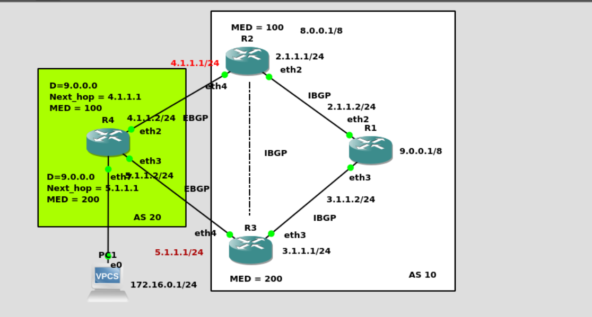

```
# R2配置
router bgp 10
 bgp router-id 2.2.2.2
 bgp always-compare-med
 no bgp ebgp-requires-policy
 neighbor 2.1.1.2 remote-as 10
 neighbor 4.1.1.2 remote-as 20

 address-family ipv4 unicast
  network 8.0.0.0/9
  neighbor 4.1.1.2 route-map SET_MED_OUT out
 exit-address-family
exit

route-map SET_MED_OUT permit 1
 set metric 100
exit

# R3配置
router bgp 10
 bgp router-id 3.3.3.3
 no bgp ebgp-requires-policy
 neighbor 3.1.1.2 remote-as 10
 neighbor 5.1.1.2 remote-as 20

 address-family ipv4 unicast
  neighbor 5.1.1.2 route-map SET_MED_OUT out
 exit-address-family
exit

route-map SET_MED_OUT permit 1
 set metric 200
exit

```

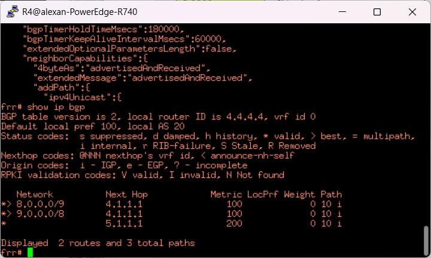

#### 8. FRR配置BGP的Local_Pref属性

- 为特定路由前缀设置  -- 推荐使用

  ```bash
  ! 匹配bgp的update报文中的NLRI中的路由
  ip prefix-list MATCH_9000 seq 1 permit 9.0.0.0/24
  
  ! 配置route-map规则, 可以配置local_pref参数
  route-map SET_LOCAL_PREF_C permit 1
   match ip address prefix-list MATCH_9000
   set local-preference 200
  exit
  
  ! 优先级低, 默认允许放行不匹配的NLRI路由, 不配置不会转发FRR
  route-map SET_LOCAL_PREF_B permit 2
   description "allow pass mismatched NLRI"
  exit
  
  ! 地址族中配置到特定邻居方向引用route-map, 发给邻居3.1.1.2的update报文中9.0.0.0/24的路由的local_pref属性设置为200
   address-family ipv4 unicast
    neighbor 3.1.1.2 route-map SET_LOCAL_PREF_C out
   exit-address-family
  ```

- 为整个邻居设置

  缺点会更新邻居之间所有NLRI的路由local_pref属性

  ```bash
  ! 设置local_pref为300
  route-map SET_LOCAL_PREF permit 1
   set local-preference 300
  exit
  
  ! 只要发往2.1.1.2邻居的NLRI中的路由的local_pref都会变成300
  address-family ipv4 unicast
    neighbor 2.1.1.2 route-map SET_LOCAL_PREF out
  exit-address-family
  ```

- 在重分发时设置

  一般用于把其他路由协议发布到bgp中

- 基于 AS Path 设置

  缺点会更新AS之间所有NLRI的路由local_pref属性

  ```bash
  route-map LOCAL_PREF_BY_AS permit 20
   match as-path 200
   set local-preference 100
  !
  
  address-family ipv4 unicast
    neighbor 2.1.1.2 route-map SET_LOCAL_PREF out
  exit-address-family
  ```