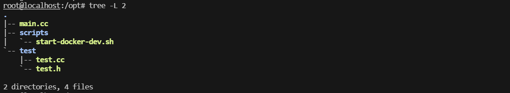

---

---

## C++之面向对象(Object oriented Programming,OOP)

[TOC]

------


### 1.面向对象的三个特性

> 继承、封装、多态

### 2.类和对象的关系

> 类是对象的抽象，对象是类的具体实例。
>
> 类是不占用内存的，对象是占用内存的。

### 3. 定义class

```c++
class 类名{
private:
	私有数据成员和成员函数;
public:
	公用数据成员和成员函数;
 // constructor
 // destructor
};
```

### 4. object的定义

#### 4.1 定义stack上object

```c++
class_name object_name;      // 调用默认无参的构造函数初始化对象
class_name object_name(...); // 调用有参的构造函数初始化
// 由编译器维护自动创建和释放, 其实就是stack上的一段堆栈而已
```

#### 4.2 定义heap上object

```c++
class_name *object_pointer = new class_name(...); // ...可以什么都没有
// 需要使用delete函数手动释放object_pointer指针
```

### 5. 类访问修饰符

```c++
public: 修饰的成员可以被随意访问
private: 修饰的成员函数和数据成员, 只能在本类中被访问(可以被本类的方法访问)
protected: 修饰的数据成员和成员函数，只能被本类访问和派生类的成员函数访问
friendly:
```

### 6.C++中struct和class的区别

> 为了兼容和拓展C，struct也可以定义类，结构体定义类可以用来写C++的数据结构，和类的用法完全相同基本，但很少使用
>
> struct定义类和class定义类的区别如下:

成员的默认访问修饰符不同

```c++
用struct声明的类，如果对其成员不做private和public声明，系统会将其默认为public
用class声明的类，如果对其成员不做private和public声明，系统会将默认为private
```

### 7. 作用域运算符::

> 用于声明函数是属于哪个类的

#### 7.1 定义类的成员函数

```c++
返回值 类名::函数名(形参列表){
	函数体;
}
```

#### 7.2 定义全局函数

```c++
返回值 ::函数名(形参列表){
	函数体;
}
```

### 8. c++编译器优化的小细节

#### 8.1 内置成员函数

> ```C++中将类内部的不带循环等控制结构的成员函数优化为内置inline成员函数```
>
> 也就是说C++会在类内将可以优化为inline函数的函数自动隐式优化为inline函数(**类外定义不会自动优化**)，所以想要在类内部声明inline函数，不需要使用inline关键字

#### 8.2 object存储结构

> C++中每个对象只存储自己的数据成员，不存储成员函数，因为成员函数都一样，所以放在特定的空间，为所有对象共享
>
> 也就是说对象的数据成员和成员函数在逻辑上是放到对象中的，而物理实现是分开存储的

### 9. 编程习惯

#### 9.1 分文件声明类和实现类

> .h文件中用于声明类和命名空间
>
> .cc文件用于实现类的成员函数

#### 9.2 分文件声明类和实现类的例子

文件目录如下



文件内容如下

```c++
// test.h
#ifndef __TEST_H__
#define __TEST_H__

#include <string>
#include <iostream>

using namespace std;

class test {

public:
	test(string, int);
	~test();
	void display();

private:
	string name;
	int age;
};

#endif
```

```c++
// test.cc
#include "test.h"

test::test(string name, int age)
{
	this->name = name;
	this->age = age;
}

test::~test()
{
	std::cout << "deconstuctor call" << std::endl;
}

void test::display()
{
	std::cout << "name: " << this->name << std::endl;
	std::cout << "age: " << this->age << std::endl;
}
```

```c++
// main.cc
#include "test/test.h"

int main(int argc, char *argv[])
{

	test b("alexan", 12);

	b.display();

	return 0;
}
```

### 10. 制作动态库和静态库


#### 10.1 制作动态库

将test/test.c打包成动态库

```bash
g++ -c -Wall -Werror -fpic -o test/test.o test/test.cc
g++ -shared -o libtest.so test/test.o
```

main.c引用动态库libtest.so

```bash
g++ main.cc -o main -L test/ -ltest
```

#### 10.2 制作静态库

将test/test.c打包成静态库

```bash
g++ -c -Wall -Werror -o test/test.o test/test.cc
ar rcs test/libtest.a test/test.o
```

main.c引用静态库

```bash
g++ main.cc -L test -ltest -o main
```

