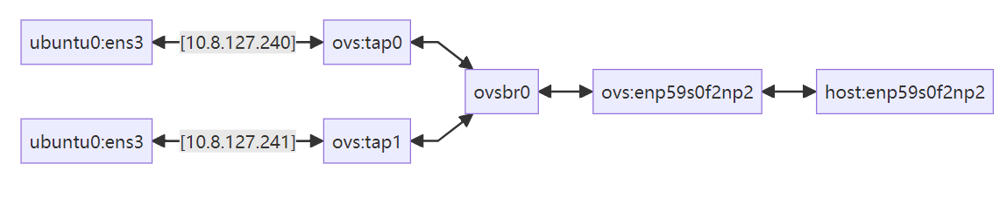
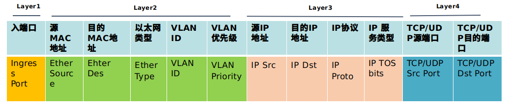

## ovs学习教程

[Open vSwitch (OVS) 全面指南：命令、操作与实例详解 - 问道语境](https://wendao.asia/archives/open-vswitch-ovs-quan-mian-zhi-nan-ming-ling-cao-zuo-yu-shi-li-xiang-jie)

#### 1. 交换机分类

- 普通交换机

- openflow交换机

  ovs(open vswitch)，ovs一般都是搭配SDN使用

#### 2. SDW控制器

- **OpenDaylight**

  [OpenDaylight](https://www.opendaylight.org/)是Linux基金会管理的开源SDN控制器，依托强大的社区支持和功能特性，已成为最受瞩目的开源SDN控制器。

- **ONOS**

  [ONOS](http://onosproject.org/)是一个开源SDN网络操作系统，主要面向服务提供商和企业骨干网。ONOS的设计宗旨是满足网络需求实现可靠性强，性能好，灵活度高等特性。此外，ONOS的北向接口抽象层和API使得应用开发变得更加简单，而通过南向接口抽象层和接口则可以管控OpenFlow或者传统设备。ONOS集聚了知名的服务提供商（AT&T、NTT通信），高标准的网络供应商（Ciena、Ericsson、Fujitsu、Huawei、Intel、NEC），网络运营商（Internet2、CNIT、CREATE-NET），以及其他合作伙伴（SRI、Infoblox），并且获得ONF的鼎力支持，通过一些真实用例来验证其系统架构。

#### 3. ovs

[Open vSwitch系列之二 安装指定版本ovs - 金色旭光 - 博客园](https://www.cnblogs.com/goldsunshine/p/10331606.html)

1. 编译安装ovs

   建议在容器里面安装

   ```bash
   #!/bin/bash
   
   ./configure
   make
   make install
   sudo modprobe openvswitch
   
   export PATH=$PATH:/usr/local/share/openvswitch/scripts
   ovs-ctl start
   ovs-ctl --no-ovs-vswitchd start
   ovs-ctl --no--ovsdb-server start
   
   mkdir -p /usr/local/etc/openvswitch
   ovsdb-tool create /usr/local/etc/openvswitch/conf.db \
       vswitchd/vswitch.ovsschema
   
   mkdir -p /usr/local/var/run/openvswitch
   ovsdb-server --remote=punix:/usr/local/var/run/openvswitch/db.sock \
       --remote=db:Open_vSwitch,Open_vSwitch,manager_options \
       --private-key=db:Open_vSwitch,SSL,private_key \
       --certificate=db:Open_vSwitch,SSL,certificate \
       --bootstrap-ca-cert=db:Open_vSwitch,SSL,ca_cert \
       --pidfile --detach --log-file
   
   ovs-vsctl --no-wait init
   ovs-vswitchd --pidfile --detach --log-file
   
   cd python && python3 setup.py install
   ```

2. 虚拟机连接测试[没有SDW情况下]

   ovs作为一个交换机，既可以工作在SDN模式也可以工作在普通交换机模式。工作在普通交换机模式下就有mac自学习功能。和普通的交换机一样，ovs交换机也能查看mac和端口关系的对应表.

   网络拓扑如下

    

   拓扑解释

   我这里直接使用vm而不是netns这类东西，是为了继续加深qemu使用，强化能力

   ```bash
   root@alexan-PowerEdge-R740:/opt/ovs# ovs-vsctl show
   5b47f412-982d-4706-a00e-25408a58378d
       Bridge ovsbr0
           Controller "tcp:127.0.0.1:6633"
               is_connected: true
           Port tap0
               Interface tap0
           Port enp59s0f2np2
               Interface enp59s0f2np2
           Port ovsbr0
               Interface ovsbr0
                   type: internal
           Port tap1
               Interface tap1
       ovs_version: "3.5.90"
   
   enp59s0f2np2是物理网口, sriov网口或者能联通外部网络的接口的虚拟接口, 这里是一个物理网口
   ubuntu0, ubuntu1是两个qemu启动的虚拟机, 基于自己的kernel和rootfs构建的, 虚拟机里面的网口ip分别如图所示, 他们的接口分别连接到ovs的网桥ovsbr0的tap0和tap1
   host是虚拟机的物理机
   
   # 启动ubuntu0, 这里使用qeumu的tun/tap模式, 让ovsbr0接管一端的tap, 根文件系统可以去我的github上下载
   sudo qemu-system-x86_64 \
       -name ubuntu0 \
       -accel kvm \
       -kernel linux/bzImage \
       -hda rootfs.img \
       -append "nokaslr root=/dev/sda rw" -nographic \
       -smp 4 \
       -m 2G,maxmem=4G \
       -netdev tap,id=net0,ifname=tap0,script=no,downscript=no \
       -device virtio-net-pci,netdev=net0,mac=52:54:00:12:34:56
   # 配置ubuntu0虚拟机里面的接口地址
   sudo ip link set dev ens3 up
   sudo ip addr add 10.8.127.240/24 dev ens3
   
   # 启动ubuntu1
   sudo qemu-system-x86_64 \
       -name ubuntu0 \
       -accel kvm \
       -kernel linux/bzImage \
       -hda rootfs.img \
       -append "nokaslr root=/dev/sda rw" -nographic \
       -smp 4 \
       -m 2G,maxmem=4G \
       -netdev tap,id=net0,ifname=tap0,script=no,downscript=no \
       -device virtio-net-pci,netdev=net0,mac=52:54:00:12:34:57
       
   # 配置ubuntu0虚拟机里面的接口地址
   sudo ip link set dev ens3 up
   sudo ip addr add 10.8.127.241/24 dev ens3
   
   # host上执行配置
   ip link set dev tap0 up
   ip link set dev tap1 up
   ip link set dev enp59s0f2np2 up
   
   # 把接口添加到ovs的ovsbr0网桥中
   ovs-vsctl add-br ovsbr0
   ovs-vsctl add-port ovsbr0 tap0
   ovs-vsctl add-port ovsbr0 tap1
   ovs-vsctl add-port ovsbr0 enp59s0f2np2
   
   # icmp测试访问
   alexan@localhost:~$ ping 10.8.127.241
   PING 10.8.127.241 (10.8.127.241): 56 data bytes
   64 bytes from 10.8.127.241: icmp_seq=0 ttl=64 time=2.187 ms
   64 bytes from 10.8.127.241: icmp_seq=1 ttl=64 time=1.061 ms
   
   # ovs自身不支持nat, 可以搭配iptables或者其他nat工具使用
   ```

3. 安装opendayligth和连接SDW控制器

   在分析之前简单介绍一个流表的组成，一个最简单的流表由3部分组成，分别是：匹配项 ，动作 ，计数器。

   

   匹配项：用来匹配流量的特征，例如传统交换机能够根据mac地址转发，路由器能够根据ip地址转发。mac，ip都是流量的特征。

   动作：动作是匹配项匹配到数据之后采取的动作，包括转发和丢弃这两个最常见的动作

   流表（低版本）可以匹配OSI模型的1层至4层，如下图所示，对匹配到的流表做转发、丢弃或者更复杂的操作。具体的匹配项如下图所示：

   [Open vSwitch (OVS) 全面指南：命令、操作与实例详解 - 问道语境](https://wendao.asia/archives/open-vswitch-ovs-quan-mian-zhi-nan-ming-ling-cao-zuo-yu-shi-li-xiang-jie)

   

   ```bash
   sudo apt install openjdk-8-jdk
   
   # vim /etc/environment 在第二行添加JAVA_HOME="/usr/lib/jvm/java-8-openjdk-amd64"
   wget https://nexus.opendaylight.org/content/groups/public/org/opendaylight/integration/distribution-karaf/0.6.4-Carbon/distribution-karaf-0.6.4-Carbon.tar.gz
   tar zvxf distribution-karaf-0.6.4-Carbon.tar.gz
   
   # 写这个配置到 /etc/org.apache.karaf.management.cfg 文件中
   #
   # Host for RMI registry
   #
   rmiRegistryHost = 127.0.0.1
   
   #
   # Port number for RMI server connection
   #
   rmiServerPort = 44444
   
   #
   # Host for RMI server
   #
   rmiServerHost = 127.0.0.1
   
   ---------------------------------------------------------------------------------------------------------
   # 启动openDayLight
   ./karaf
   
   # 在openDayLigth命令行里面安装组件
   opendaylight-user@root>feature:install odl-restconf odl-l2switch-switch-ui odl-dluxapps-applications odl-openflowplugin-flow-services-ui odl-mdsal-apidocs odl-dluxapps-applications odl-faas-all odl-faas-all
   
   # 查看openDayLigth进程
   netstat -anput | grep 6633
   
   # ovs连接控制器
   ovs-vsctl set-controller br-test tcp:127.0.0.1:6633
   
   # 此时网络因该不通了, 因为此刻ovs上查找不到openflow的规则
   root@alexan-PowerEdge-R740:/opt/ovs# ovs-vsctl show
   5b47f412-982d-4706-a00e-25408a58378d
       Bridge ovsbr0
           Controller "tcp:127.0.0.1:6633"
               is_connected: true
           Port tap0
               Interface tap0
           Port enp59s0f2np2
               Interface enp59s0f2np2
           Port ovsbr0
               Interface ovsbr0
                   type: internal
           Port tap1
               Interface tap1
       ovs_version: "3.5.90"
       
   # openflow配置允许tap0到tap1的流量, 注意这是单向流量 - 手动下发流表
   ovs-ofctl add-flow ovsbr0 "in_port=tap0,actions=output:tap1"
   
   root@alexan-PowerEdge-R740:/opt/ovs# ovs-ofctl dump-flows ovsbr0
    cookie=0x0, duration=2055.368s, table=0, n_packets=18, n_bytes=1204, in_port=tap0 actions=output:tap1
    
   # 测试和抓包, ubuntu0访问ubuntu1此时因该是可以在tap1接口上抓到arp的请求和响应, tap0上只有请求, 因为此时是单向通信的,tap1->tap0的报文被默认丢弃了
   
   # ubuntu0的icmp请求
   alexan@localhost:~$ ping 10.8.127.241
   PING 10.8.127.241 (10.8.127.241): 56 data bytes
   ^C--- 10.8.127.241 ping statistics ---
   2 packets transmitted, 0 packets received, 100% packet loss
   
   # ovs上的tap0的抓包, 这个接口是连接到ubuntu0的
   root@alexan-PowerEdge-R740:/opt/ovs# ovs-tcpdump -i tap0
   tcpdump: verbose output suppressed, use -v[v]... for full protocol decode
   listening on mitap0, link-type EN10MB (Ethernet), snapshot length 262144 bytes
   11:12:06.775001 IP 10.8.127.240 > 10.8.127.241: ICMP echo request, id 376, seq 0, length 64
   11:12:07.775372 IP 10.8.127.240 > 10.8.127.241: ICMP echo request, id 376, seq 1, length 64
   11:12:11.984531 ARP, Request who-has 10.8.127.241 tell 10.8.127.240, length 28
   11:12:13.008177 ARP, Request who-has 10.8.127.241 tell 10.8.127.240, length 28
   11:12:14.032236 ARP, Request who-has 10.8.127.241 tell 10.8.127.240, length 28
   
   # ovs上的tap1的抓包, 这个接口是连接到ubuntu1的
   root@alexan-PowerEdge-R740:/opt/ovs# ovs-tcpdump -i tap1
   tcpdump: verbose output suppressed, use -v[v]... for full protocol decode
   listening on mitap1, link-type EN10MB (Ethernet), snapshot length 262144 bytes
   11:12:06.775016 IP 10.8.127.240 > 10.8.127.241: ICMP echo request, id 376, seq 0, length 64
   11:12:06.775648 IP 10.8.127.241 > 10.8.127.240: ICMP echo reply, id 376, seq 0, length 64
   11:12:07.775385 IP 10.8.127.240 > 10.8.127.241: ICMP echo request, id 376, seq 1, length 64
   11:12:07.775727 IP 10.8.127.241 > 10.8.127.240: ICMP echo reply, id 376, seq 1, length 64
   11:12:11.984543 ARP, Request who-has 10.8.127.241 tell 10.8.127.240, length 28
   11:12:11.985147 ARP, Reply 10.8.127.241 is-at 52:54:00:12:34:57 (oui Unknown), length 28
   11:12:12.052166 ARP, Request who-has 10.8.127.240 tell 10.8.127.241, length 28
   
   # openflow配置允许tap1->tap流量 - 手动下发流表
   ovs-ofctl add-flow ovsbr0 "in_port=tap1,actions=output:tap0"
   
   root@alexan-PowerEdge-R740:/opt/ovs# ovs-ofctl dump-flows ovsbr0
    cookie=0x0, duration=2450.297s, table=0, n_packets=23, n_bytes=1526, in_port=tap0 actions=output:tap1
    cookie=0x0, duration=1.503s, table=0, n_packets=0, n_bytes=0, in_port=tap1 actions=output:tap0
   
   # ubunt0访问测试
   alexan@localhost:~$ ping 10.8.127.241
   PING 10.8.127.241 (10.8.127.241): 56 data bytes
   64 bytes from 10.8.127.241: icmp_seq=0 ttl=64 time=2.300 ms
   ^C--- 10.8.127.241 ping statistics ---
   1 packets transmitted, 1 packets received, 0% packet loss
   round-trip min/avg/max/stddev = 2.300/2.300/2.300/0.000 ms
   
   
   # 或者直接放行l2/l3
   ovs-ofctl add-flow ovsbr0 "dl_type=0x0800,actions=normal"
   ovs-ofctl add-flow ovsbr0 "dl_type=0x0806,actions=normal"
   ```

#### 4. Mininet仿真网络使用

Mininet是一个基于Linux Container架构的进程虚拟化网络仿真工具，它允许用户在个人电脑上创建一个包含主机、交换机、控制器和链路的虚拟网络环境。这对于SDN（软件定义网络）和OpenFlow协议的开发和测试非常有用。本文将详细介绍如何在Ubuntu系统中快速安装和配置Mininet

```bash
# 可以再单独的容器里面安装和使用mininet
```

#### 5. gns3虚拟环境搭建

openvswitch.gns3a镜像在[openvswitch.gns3a](../simulator/gns3/img/openvswitch.gns3a)，你可以下载这个镜像然后导入到本地gns3上，即可获得openvswitch镜像设备进行试验

安装gns3教程: [install gns3](https://docs.gns3.com/docs/getting-started/installation/linux)

导入application教程参考: [import application](https://docs.gns3.com/docs/getting-started/setup-wizard-local-server)

#### 6. ovs实验

[Open vSwitch 入门实践 - lsgxeva - 博客园](https://www.cnblogs.com/lsgxeva/p/18050159)

- 无隔离二层网络
- 带vlan二层网络

#### 7. ovs-dpdk架构

这个是重点，sriov+ovs-dpdk实现云组网

[OVS DPDK | SDN](https://sdn.feisky.xyz/wang-luo-ji-chu/index-3/ovs-dpdk)

[OpenvSwitch系列之十一 ovs-dpdk - 金色旭光 - 博客园](https://www.cnblogs.com/goldsunshine/p/14260941.html)

#### x. refer

- SDW文档

  [🎛️【SDN】SDN 控制器调研](https://yinxiu.in/2020/sdn-controllers.html#sdn-控制器的发展)

  [OpenDaylight | SDN](https://sdn.feisky.xyz/sdn-and-nfv/index/controller/opendaylight)

- OVS文档

  [Open vSwitch (OVS) 全面指南：命令、操作与实例详解 - 问道语境](https://wendao.asia/archives/open-vswitch-ovs-quan-mian-zhi-nan-ming-ling-cao-zuo-yu-shi-li-xiang-jie)

  [Open vSwitch 文档（中文） — ovs 0.9 documentation](https://ovs.readthedocs.io/en/latest/index.html)

  [Open vSwitch系列之二 安装指定版本ovs - 金色旭光 - 博客园](https://www.cnblogs.com/goldsunshine/p/10331606.html)

  [【docker+openvswitch系列一】在ubuntu下搭建docker环境_open vswitch docker ui-CSDN博客](https://blog.csdn.net/weixin_44753983/article/details/104474263)

  