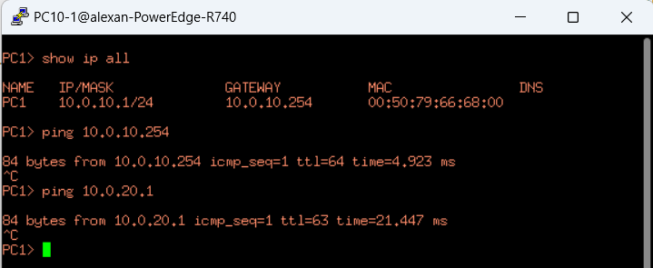
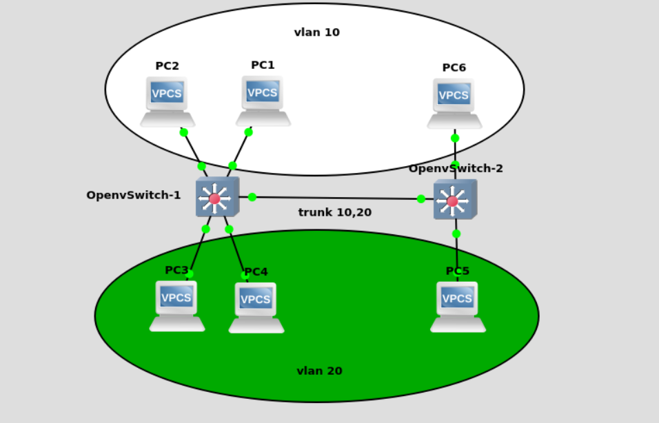

## ovs vlan 实验描述文档

#### 1. vlan的一些模糊问题

   1. 交换机端口不配置vlan情况下
        
        + 交换机下的端口连接的所有终端在同一个网段
            
            这种情况下，默认所有终端都可以通信，因为没有跨网段，不需要路由，只需要查找mac表即可转发
        + 交换机下的端口连接的所有终端在不同网段

            不同网段之间通信，需要进行路由，二层交换机默认不支持路由操作
            
            这种情况下，默认所有终端无法通信，因为二层交换机无法进行路由，所以需要配置默认网关，通过网关来获取路由，实现间接3层通信
   2. 交换机端口配置vlan情况下
    
        + 相同vlan之间的主机如何通信

            默认通过交换机直接可以通信
        + 不同vlan之间的主机如何通信

            这种情况下，一般不同vlan下的主机的网段是和vlan保持一致的，也就是说不同vlan的端口连接的终端的地址是在不同网段的，因为需要路由才可以通信

            解决方法:
                
                给每个vlan配置一个属于这个vlan的网关，这个vlan下的所有主机的默认网关都配置成相应的vlan的网关地址，实现三层路由

            gns3实验拓扑:

            

            实验配置:

            ```bash
            # 1. ovs配置

            # 配置pc1连接的port的vlan 为10, 配置pc1连接的port的vlan 为20
            ovs-vsctl set port eth0 tag=10
            ovs-vsctl set port eth1 tag=20

            # 设置vlan 10的网关接口vlan10
            ovs-vsctl add-port br0 vlan10 tag=10 -- set Interface vlan10 type=internal
            ip link set dev vlan10 up
            ip addr add 10.0.10.254/24 dev vlan10

            # 设置vlan 10的网关接口vlan10
            ovs-vsctl add-port br0 vlan20 tag=20 -- set Interface vlan20 type=internal
            ip link set dev vlan20 up
            ip addr add 10.0.20.254/24 dev vlan20

            # 2. pc10-1配置
            ip 10.0.10.1/24 10.0.10.254

            # 3. pc20-1配置
            ip 10.0.20.1/24 10.0.20.254
            ```

            测试:
            

#### 2. vlan的access和trunk实验

报文进入指定端口添加vlan，然后转发到同vlan的接口上，报文出去时候要解掉vlan，trunk接口可以放行多个vlan，access接口仅可以放行单个vlan

+ 实验拓扑

    

+ 实验配置

    OpenvSwitch-1配置
    ```bash
    ovs-vsctl set port eth0 tag=10
    ovs-vsctl set port eth1 tag=10
    ovs-vsctl set port eth2 tag=20
    ovs-vsctl set port eth3 tag=20

    ovs-vsctl set port eth4 trunks=10,20
    ```
    OpenvSwitch-2配置
    ```bash
    ovs-vsctl set port eth0 tag=20
    ovs-vsctl set port eth1 tag=10

    ovs-vsctl set port eth4 trunks=10,20
    ```

    pc1和pc2配置
    ```bash
    ip 10.0.10.1/24
    ip 10.0.10.2/24
    ```

    pc3和pc4配置
    ```bash
    ip 10.0.20.3/24
    ip 10.0.20.4/24
    ```

    pc5和pc6配置
    ```bash
    ip 10.0.20.5/24
    ip 10.0.10.6/24    
    ```


